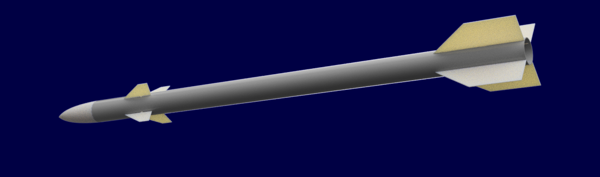
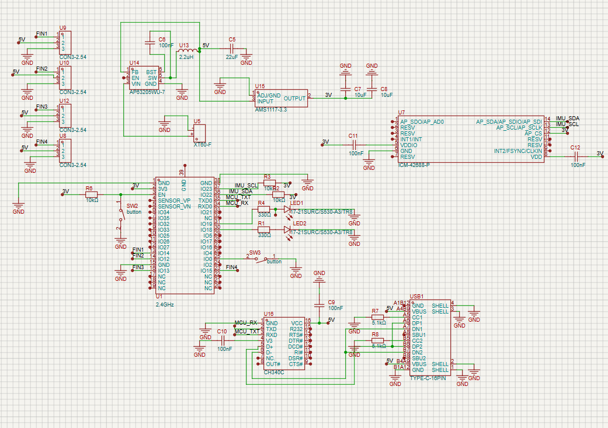
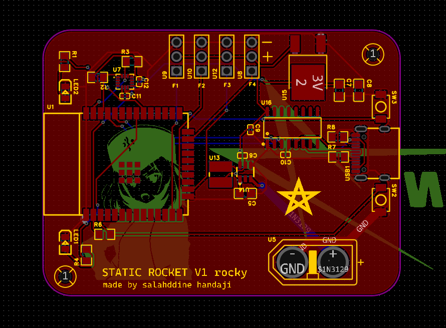
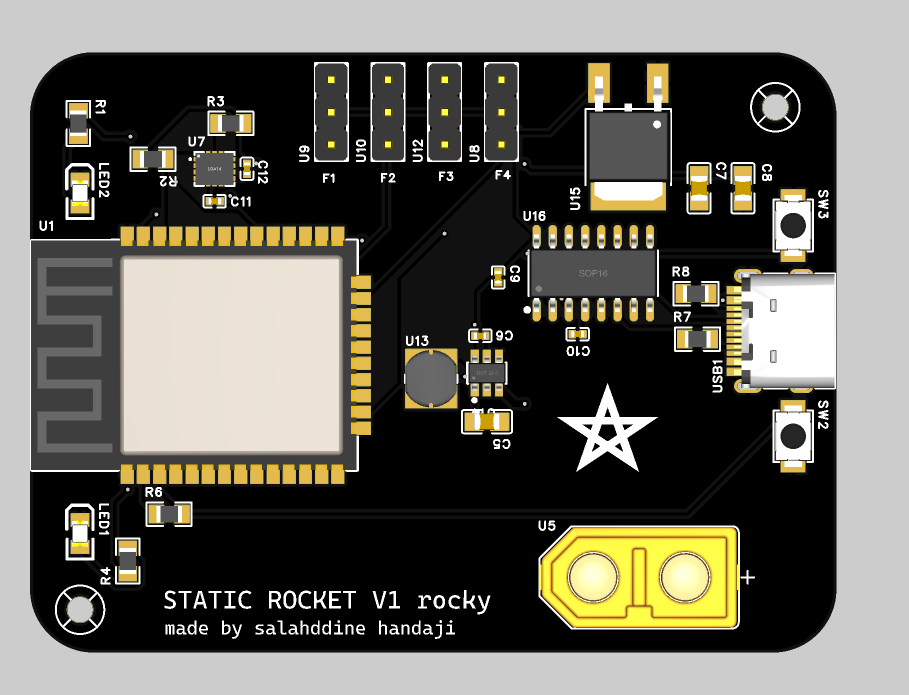
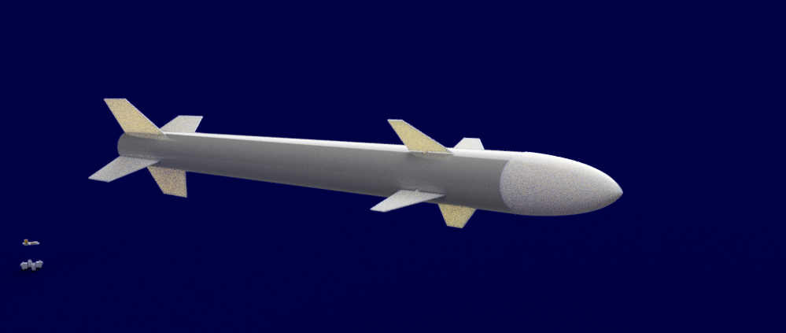
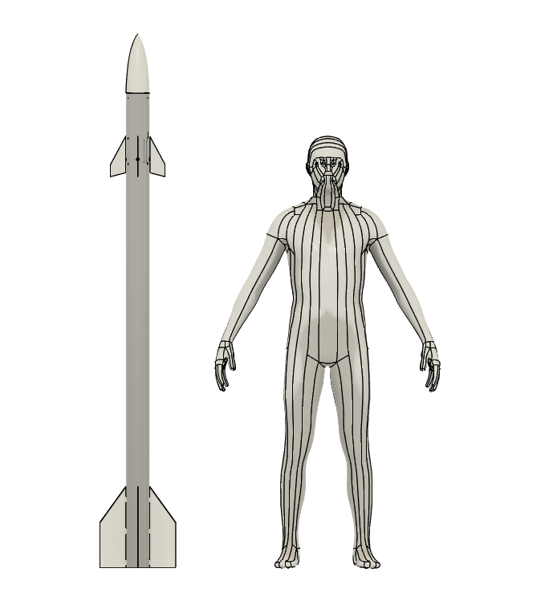

# Rocky V1 
Rocky V1 is a Static rocket with actuated fins designed for decoration and also to learn more mechanical and electrical knowledge about rocket since they are banned here ):  

## Functions  
- controlable from wifi and bluethoot
- pre recorded fin movement
- stabilisation feature
- live fins movement
- look good infront of visitors :) 

---

##  Hardware Specifications

### Core System
* **MCU:** ESP32-WROOM-32E (Dual-core 32-bit MCU running at 240MHz with built-in Wi-Fi and Bluetooth).
* **IMU:** ICM-42688-P 6-axis high-performance inertial measurement unit (SPI/I2C interface for tracking pitch, roll, and yaw).
* **Actuators:** 4x independent 3-pin PWM servo headers (`F1` to `F4`) for active control surface simulation.

### Power & Connectivity
* **Input Power:** XT60-F heavy-duty battery connector.
* **Buck Converter:** AP63205 synchronous step-down converter (1.1MHz switching frequency, capable of supplying up to 2A for servos).
* **LDO Regulator:** AMS1117-3.3 dedicated to providing a low-noise power rail for the microcontroller.
* **USB Interface:** CH340C USB-to-UART bridge with a standard Type-C port for programming and debugging.

---

##  Design & Cost Optimization

The Bill of Materials (BOM) was optimized for production and budget constraints prior to manufacturing:
### BOM 
| Component | quantity | Price (in dh) | info |
| :--- | :---: | :---: | :--- |
| PVC Tube | 1 | 50 | Diameter : 100mm / height : 3 m |
| Servo motor | 4 | 75.5 | SG90 blue servo |
| PCB / PCBA | 5 | 806.33 | For 5 pcbs with 2 off them assembled |
| 3d prints | 1 | 200 | Printing |
| Battery | 1 | already owned | 3s lipo 30c |
| **TOTAL** | | **1131.83dh ($122.26)** | |

---

##  Mechanical Layout
The physical structure features a high-aspect-ratio sounding rocket body optimized for 3D printing:
* **Modular Assembly:** Divided into distinct cylindrical segments to fit standard 3D printer build volumes.
* **Internal Avionics Sled:** Built-in internal tracking guide rails allow the rectangular "Rocky V1" PCB to slide down the central axis and lock securely in position, ensuring a rigid $0^\circ$ alignment constraint for the IMU sensor.

---

## Awesome Pics 

*Designed and engineered by Salahddine Handaji — 2026*
