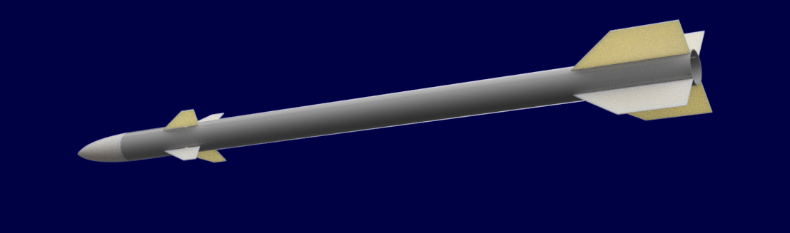
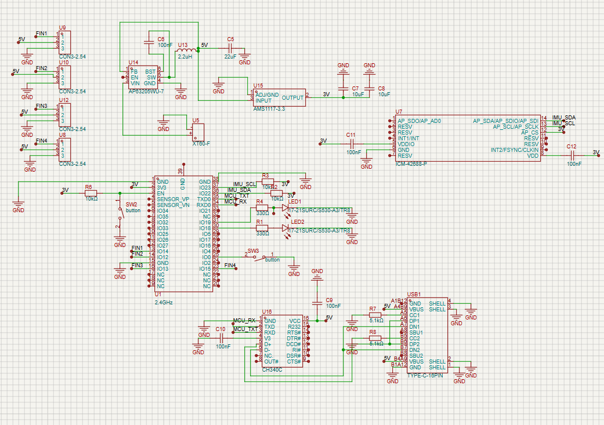
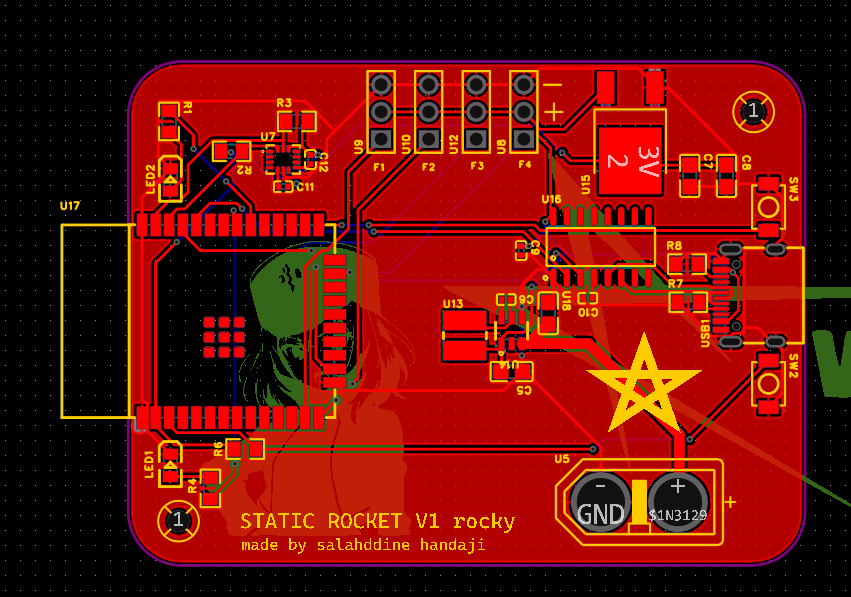
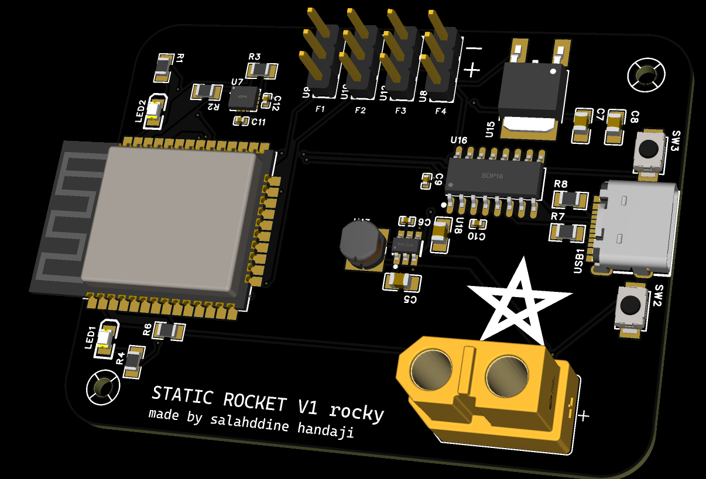
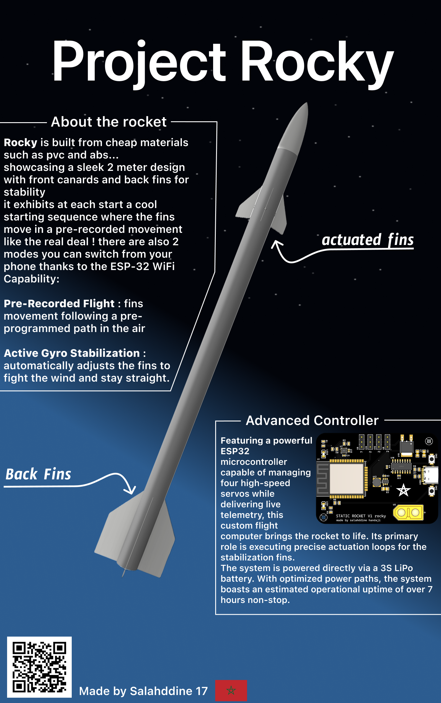
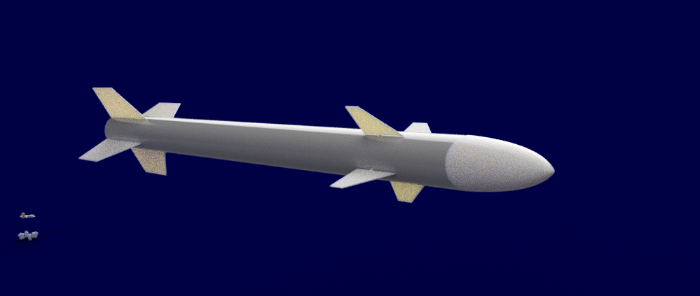
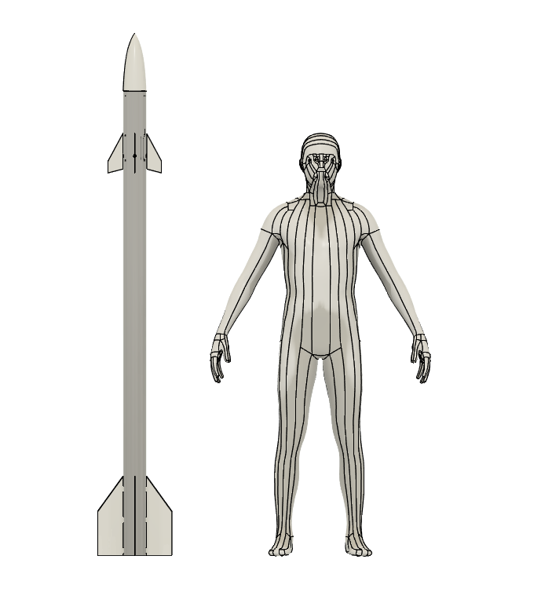

# Rocky V1 
Rocky V1 is a Static rocket with actuated fins designed for decoration, 
## Why did do this
i made this project to learn more mechanical and electrical knowledge about rocket since they are banned here ):  

## Functions  
- Controlable from wifi and bluethoot
- Pre recorded fin movement
- Stabilisation feature
- Live fins movement
- Look good infront of visitors :)

## How to build 
to build or make this rocket you need first of all to buy the everything the BOM has then take your pvc tube and drill slots where ur 3d printed fins will attach and drill a second hole in the upper section for the movable fins slide the payload section which is also 3d printed but before that screw in the flight controller and the servo then slide it in then align the servo with the hole we just made and attach the smaller fins in there Finally put the nose cone in and tada you have a rocket
## To make it work 
plug the battery ( 3s = 12v ) thru the xt60 and then plug the usb-c flash it with the available code in the repo then open up your browser and you can control it from there or flash it with whatever program you want its literally just 4 servos ! 

---

##  Hardware Specifications

### Core System
* **MCU:** ESP32-WROOM-32E-N8 (Dual-core 32-bit MCU running at 240MHz with built-in Wi-Fi and Bluetooth).
* **IMU:** ICM-42688-P 6-axis high-performance inertial measurement unit (SPI/I2C interface for tracking pitch, roll, and yaw).
* **Actuators:** 4x independent 3-pin PWM servo headers (`F1` to `F4`) for active control surface simulation.

### Power & Connectivity
* **Input Power:** XT60-F heavy-duty battery connector.
* **Buck Converter:** AP63205 synchronous step-down converter (1.1MHz switching frequency, capable of supplying up to 2A for servos).
* **LDO Regulator:** AMS1117-3.3 dedicated to providing a low-noise power rail for the microcontroller.
* **USB Interface:** CH340C USB-to-UART bridge with a standard Type-C port for programming and debugging.

## Wire diagram 

---

##  Design & Cost Optimization

The Bill of Materials (BOM) was optimized for production and budget constraints prior to manufacturing:
### BOM 
| Component | quantity | Price (in dh) | info |
| :--- | :---: | :---: | :--- |
| PVC Tube | 1 | 50 | Diameter : 100mm / height : 3 m |
| Servo motor | 4 | 100 | SG90 blue servo |
| PCB / PCBA | 5 | 662.41| For 5 pcbs with 2 off them assembled |
| 3d prints shipping | 1 | 300 | Printing shipping fee|
| Battery | 1 | already owned (100) | 3s lipo 30c |
| **TOTAL** | | **1,212dh ( 131.38$)** | |

---

##  Mechanical Layout
The physical structure features a high-aspect-ratio sounding rocket body optimized for 3D printing:
* **Modular Assembly:** Divided into distinct cylindrical segments to fit standard 3D printer build volumes.
* **Internal Avionics Sled:** Built-in internal tracking guide rails allow the rectangular "Rocky V1" PCB to slide down the central axis and lock securely in position, ensuring a rigid $0^\circ$ alignment constraint for the IMU sensor.

---

## Awesome Pics 
# ZINE

---

---

*Designed and engineered by Salahddine Handaji — 2026*
